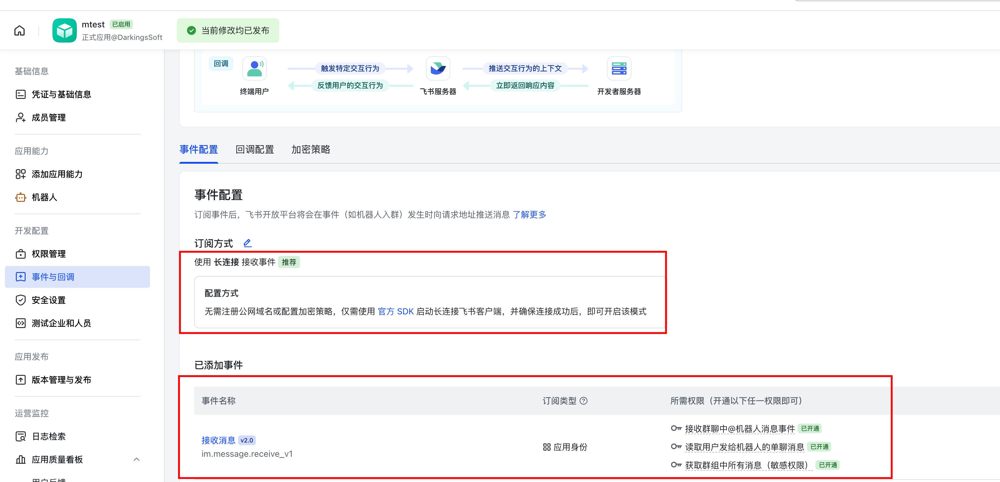
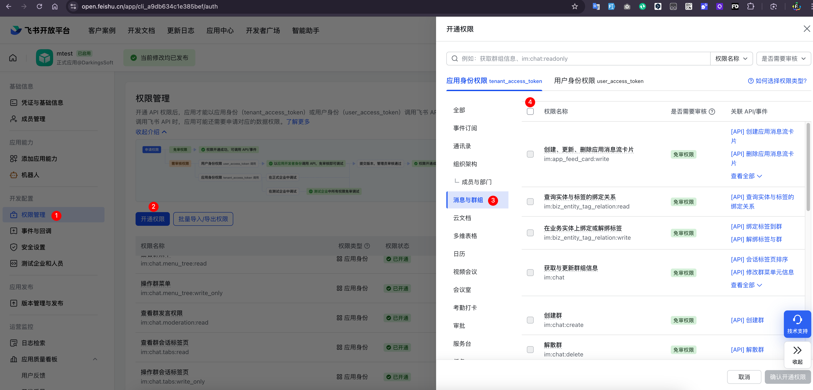

# spring-ai-mcp-demo

基于 AI + mcp server + mcp client + 飞书机器人实现的简单 AI 聊天示例

## 1. 准备工作

### 1.1 大模型 API key
我用的是`智谱 AI`，可以自行注册账号获取 API key
https://bigmodel.cn/usercenter/proj-mgmt/apikeys


### 1.2 飞书应用机器人创建
没有飞书的可以自己注册个账号创建

1. 前往 https://open.feishu.cn/app 创建应用
2. 配置事件与回调、权限管理
3. 最后发布应用，获取 App ID 和 App Secret





## 2. 启动步骤
1. 打包[mcp-server](mcp-server)

```shell
cd mcp-server
mvn clean install
```
2. 替换[mcp-client](mcp-client) 下 的 `application.yml` 中的飞书应用相关配置以及mcp-server-0.0.1-SNAPSHOT.jar的路径
```yml

lark:
  bot:
    app-id: [你的飞书应用 App ID]
    app-secret: [你的飞书应用 App Secret]

spring:
  ai:
    zhipuai:
      api-key: [你的智谱AI API key]
    mcp:
      client:
        stdio:
          connections:
            spring-ai-mcp-weather:
              command: java
              args:
                  - -Dspring.ai.mcp.server.stdio=true
                  - -jar
                  - /path/to/mcp-server-0.0.1-SNAPSHOT.jar
```

3. 直接启动 mcp-client spring boot 应用

## 3. Screenshots

