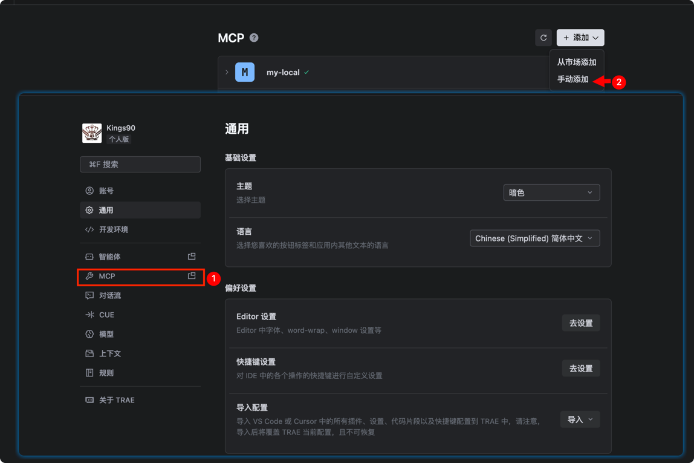
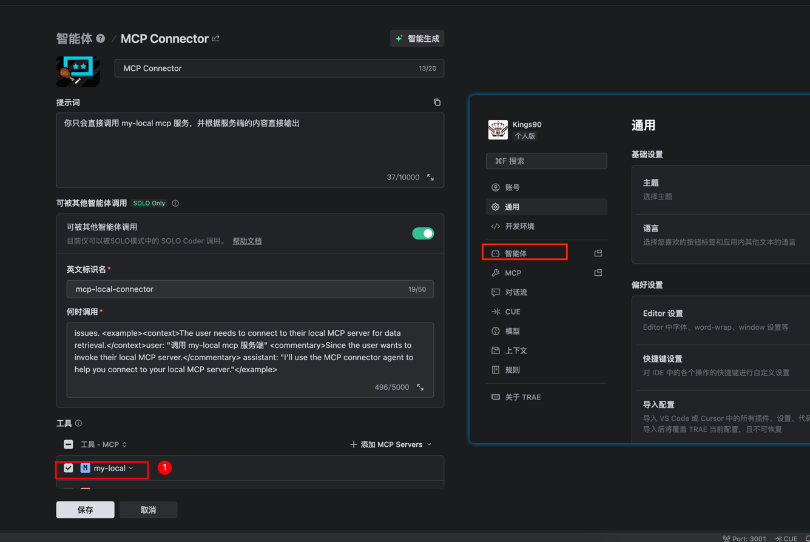
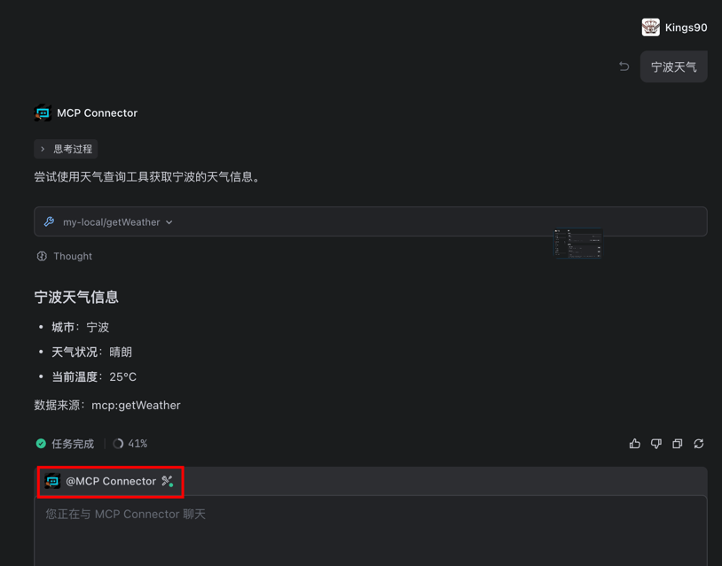

# spring-ai-mcp-demo

基于 AI + mcp server + mcp client + 飞书机器人实现的简单 AI 聊天示例

基于 AI + mcp server + tare ide(mcp+agent) 实现的简单 AI 聊天示例

## 1. 准备工作

### 1.1 大模型 API key
我用的是`智谱 AI`，可以自行注册账号获取 API key
https://bigmodel.cn/usercenter/proj-mgmt/apikeys


### 1.2 飞书应用机器人创建
没有飞书的可以自己注册个账号创建

1. 前往 https://open.feishu.cn/app 创建应用
2. 配置事件与回调、权限管理
3. 最后发布应用，获取 App ID 和 App Secret


## 2. 启动步骤

### 2.1 Jar 模式启动
1. 打包[mcp-server](mcp-server)

```shell
cd mcp-server
mvn clean install
```
2. 替换[mcp-client](mcp-client) 下 的 `application-jarMode.yml` 中的飞书应用相关配置以及mcp-server-0.0.1-SNAPSHOT.jar的路径
```yml

lark:
  bot:
    app-id: [你的飞书应用 App ID]
    app-secret: [你的飞书应用 App Secret]

spring:
  ai:
    zhipuai:
      api-key: [你的智谱AI API key]
    mcp:
      client:
        stdio:
          connections:
            spring-ai-mcp-weather:
              command: java
              args:
                  - -Dspring.ai.mcp.server.stdio=true
                  - -Dspring.profiles.active=jarMode
                  - -jar
                  - /path/to/mcp-server-0.0.1-SNAPSHOT.jar
```

3. 直接启动 mcp-client spring boot 应用，profile 选择 jarMode,不需要额外启动 mcp-server
4. 检查是否连接飞书应用机器人成功

日志里面可以搜到说明飞书机器人连接成功的字样
```
connected to wss://msg-frontier.feishu.cn/
```
5. 在飞书应用中给机器人发送消息，例如`北京`，等待回复

### 2.2 http 模式启动
1. 启动[mcp-server](mcp-server)，注意启动时需要指定 spring profile 为 **httpMode**

2. 替换[mcp-client](mcp-client) 下 的 `application-httpMode.yml` 中的飞书应用相关配置,其他的不用动
```yml
lark:
  bot:
    app-id: [你的飞书应用 App ID]
    app-secret: [你的飞书应用 App Secret]

spring:
  ai:
    zhipuai:
      api-key: [你的智谱AI API key]
```

## 3. Screenshots
### 3.1 飞书机器人收到消息并回复


### 3.2 TARE IDE下 mcp + agent 示例
1. TARE 添加本地 MCP


输入配置
```yml
{
  "mcpServers": {
    "my-local": {
      "url": "http://localhost:8081/mcp/sse"
    }
  }
}
```

2. 创建 Agent 并设置 MCP
   

何时调用描述，也可以参考下面的示例，我这边是智能模式生成 ai 帮我生成好的
``` txt
Use this agent when you need to interact with a local MCP (Model Context Protocol) server, establish connections to my-local mcp services, or troubleshoot MCP server communication issues. <example><context>The user needs to connect to their local MCP server for data retrieval.</context>user: "调用 my-local mcp 服务端" <commentary>Since the user wants to invoke their local MCP server.</commentary> assistant: "I'll use the MCP connector agent to help you connect to your local MCP server."</example>
```

3. 在 TARE 编辑器中聊天
